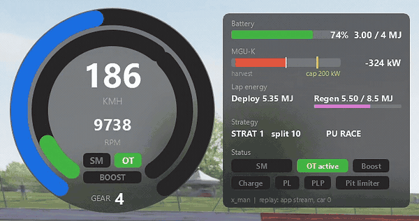
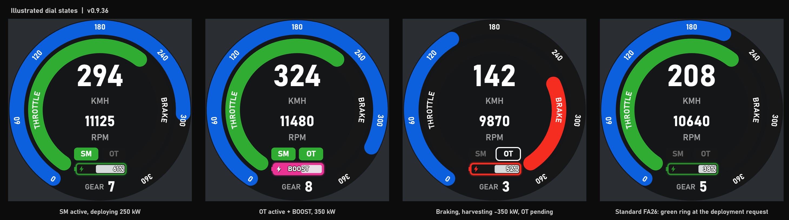

# F1 2026 Speedometer HUD

[简体中文](README.zh-CN.md)

A broadcast-style speedometer for Assetto Corsa. It follows the camera car and selects the
appropriate FA26 Pro, native FA26 or conventional DRS display, keeping the v0.9.1 dial design.

Version **0.9.36** writes `BOOST` inside the glyph while that command is held. **0.9.35** gave the
standard FA26 its own deployment indication on the battery glyph that
**0.9.3** introduced in place of the two side bars; the word appears on both cars, the Pro adapter is
that of 0.9.3, the standard car's compact panel gains a second chip, and both replay-stream layouts
are unchanged from 0.9.2. The [changelog](CHANGELOG.md) lists what each version changed. See
[compatibility and validation](docs/COMPATIBILITY.md) for what has been checked in game and what
is still pending.
The throttle arc shows AC's physics throttle, including the automatic gearbox's brief upshift
cut and the downshift auto-blip ([known issues](docs/KNOWN-ISSUES.md)).

*Demo recorded before the v0.9.1 dial update; the updated dial is illustrated below.*

The app runs in Custom Shaders Patch (CSP). It combines a MultiViewer-style dial with the car's
energy telemetry, so you can monitor deployment and harvesting while driving or watching a replay.
It reads the selected car's available data and does not modify car or track files. AI and
remote cars can expose fewer fields; missing data is never replaced by the player's controls.

## Vehicle compatibility

| Car | Display | Energy and replay |
| --- | --- | --- |
| FA26 Pro, exact ID `vrc_formula_alpha_2026_csp` | SM / OT / BOOST | Full Pro panel and original Pro replay stream |
| Native FA26, exact ID `vrc_formula_alpha_2026` | Simplified SM / OT / BOOST; OT stays dark, the car has no overtake channel | Battery %, LOW / MEDIUM / HIGH / NODEPLOY, manual BOOST, Straight Mode, deployment request and recovery state |
| FA25 and other conventional cars | One centered DRS indicator, green only for a valid active state | No Pro energy panel; exact FA25 CSP gets a small DRS recording when native replay history is unavailable |
| Cars without DRS | The same DRS indicator, always dark | No energy panel |

The **car selects the layout**. Track zones and rules affect availability, and actual reported
state controls activation. A FA25 on a 2026 track still shows DRS; a Pro without CAN data still
uses the Pro layout. Unknown state leaves indicators dark and numeric readings as `--`.

## Display

**Dial:** speed, RPM and gear, with a blue speed arc, green throttle arc and red brake arc.
The speed scale runs from 0 to 360 km/h in steps of 60; above 360, the arc stays full while the
central number continues to show the actual speed. Curved `THROTTLE` and `BRAKE` labels identify
the input arcs. The layout and colours follow the MultiViewer style and are drawn in code.
For **FA26 Pro**, three indicators show the 2026 systems:

| Indicator | Dark | Colour states |
| --- | --- | --- |
| `SM` Straight Mode | not available | white = available, press to pre-latch · blue = pre-latched, engages at the zone · yellow = available but already inside the zone · green = wings in Straight Mode position |
| `OT` Overtake | not available | white outline = granted, waiting for the activation line · green = active this lap |
| Battery glyph | `--` with an idle ring | body magenta and reading `BOOST` while the Boost button is held / toggled · ring and terminal red while harvesting, green while deploying, magenta while Boost deploys, brighter with more power · bolt in the same hue, white on the magenta body · fill and digits amber when the figure is 10 % or less |

**Battery glyph:** the usable charge as a fill with the percentage inside, in the slot below `SM` / `OT`.
The terminal is on the left and the fill is anchored to the right, so deploying moves the fill edge to
the right and harvesting moves it to the left, the same directions as the panel's MGU-K bar. The ring
around it shows the MGU-K flow of the current update, with brightness, width and a small halo
following the power on the Pro and the deployment request on the standard FA26. Nothing animates on
its own apart from the optional 120 ms brightness easing
(on by default; the state and hue are never eased). The body carries the Boost button exactly as the
former `BOOST` badge did, so Boost held into a braking zone reads as a magenta body with a red ring,
and while the command is held the body reads `BOOST` in place of the percentage — the fill still
shows the level, and once the charge is down to a single digit the amber number returns beside the
word. Switching the glyph off in settings brings the `BOOST` badge back.

**Pro energy panel:** can be shown or hidden in settings or with a bound key or wheel button.

- Battery: usable energy as a bar, `%` and `MJ / 4 MJ`.
- MGU-K: live power, green when deploying and red when harvesting, with a tick at the current
  power cap. The cap label reads `cap 200 kW` in a power-reduction zone, `cap 0 kW` when
  deployment is blocked and `clip -350 kW` while the car super-clips (forced harvesting at full
  throttle).
- Lap energy: deployed and harvested energy in MJ, with a bar showing progress towards the
  harvesting limit reported by the car. The limit varies by track and session; Overtake adds 0.5 MJ.
- Strategy: `STRAT n`, the current deployment-map split, and the PU mode name.
- Status chips: SM state, OT state, Boost, Charge mode, PL / PLP (power-limited states), pit limiter.

**Native FA26** has a compact panel with battery percentage, the native deployment name and a
`Deploying` / `Recovering` chip pair. Its battery glyph shows a green ring while the car's delivery
controller requests energy, brightness following that request; a red ring at a fixed brightness
while the car reports recovery; and a magenta body while the button is pressed. The request is what
the selected map asks for at the current throttle and speed, not a measured output: the ring is
never green in `NODEPLOY`, at very low speed or at the top of the speed range, where recovery can
still turn it red, and the green and red
brightnesses are separate declared scales that cannot be compared with each other or with the Pro's
power scale. BOOST represents the native manual override command, not automatic deployment or
guaranteed output power.
Native SM uses only off / available / active; it has no Pro pre-latch or late state. OT stays
dark, because this car has no overtake channel. Recovery is distinct from Pro Charge / Anti mode.
No Pro MJ capacity, kW estimate, lap-recovery quota, split or PU mode is assigned to this car.

By default, the HUD follows the **camera-focused car**. You can switch between cars in a replay
to view their recorded data, or bind a button to keep the HUD on your own car.

## 2026 regulations

The following describes how these systems work in the VRC Formula Alpha 2026 Pro.

- **Straight Mode (SM, "X-mode")** opens the front and rear wing flaps to reduce drag. It is
  available to every car in the designated zones, without a gap requirement. Before entering a
  zone, press the button (DRS by default) at 200 km/h or more to pre-latch it. The wings open at
  the zone start at full throttle above 150 km/h, then close when you brake or drop below 90%
  throttle.
- **Overtake (OT)** changes the MGU-K power limit. Crossing the detection line within 1 s of
  the car ahead grants Overtake for the following lap: full 350 kW is available up to 337 km/h,
  rather than tapering from 290 km/h, and the harvesting allowance increases by 0.5 MJ. Overtake
  is always active in practice and qualifying.
- **Boost** overrides the deployment map and requests the current MGU-K power cap. It remains
  subject to the available battery energy and power limits, including those set by Overtake.
- **PL / PLP** indicate active and pending power limits. These relate to rules governing power
  changes, including a 200 kW minimum at full throttle for 1 s, a maximum reduction of 150 kW
  and limits on the rate of change.

## Requirements

- Assetto Corsa with Custom Shaders Patch. The VRC Formula Alpha 2026 needs CSP
  0.3.0-preview542 or newer. The app was developed and tested on build 4116.
- Pro energy data requires **VRC Formula Alpha 2026 Pro**. Native FA26 and conventional DRS
  use separate adapters; other manufacturers' custom 2026 systems are not supported.
- The app consists of two Lua files and a manifest. No separate DLL, SimHub or Python installation
  is required.

## Install

**Release zip:** download `f1-2026-speedometer-hud-v0.9.36.zip` from the
[v0.9.36 release](https://github.com/Zhaoyi-Fan/f1-2026-speedometer-hud/releases/tag/v0.9.36)
and extract it into your Assetto Corsa root folder (the
one with `acs.exe`). You should end up with
`assettocorsa\apps\lua\f1_2026_speedometer_hud\manifest.ini`. Dropping the zip onto Content Manager
also works.

**Updating:** close the current game session, install the new zip over the existing app and
allow its files to be replaced. The existing HUD settings are retained. Start a new session or
replay and check that the settings window shows version **0.9.36**. The dial no longer has side
bars, so the window is 340 units wide plus the panel for every car (with the bars on it was up to
98 units wider for the Pro and 62 for the standard FA26) and the energy panel sits closer to the
dial; drag the window once if it lands somewhere new.

**From source:** close AC and run `tools\deploy.ps1 -AcRoot "D:\path\to\assettocorsa"
-BackupRoot "D:\HUD-backups"` in PowerShell. The backup folder must be outside the repository
and game installation. The script backs up and verifies only the three managed app files,
retaining settings and unrelated files.
To undo one installation, use the same script with `-AcRoot` and
`-RestoreManifest "D:\HUD-backups\<deployment>\deployment.json"`.

Then in game: open the CSP apps sidebar and enable **F1 2026 Speedometer HUD**. The HUD window
has no background; hover it to get the title bar and drag it where you want it.

## Usage

- Open the app's settings (gear icon on the HUD's floating title bar).
- **Display**: scale, show the energy panel, battery glyph in the dial (off restores the `BOOST`
  badge), ease the battery ring brightness, follow the camera-focused car, lock to the player car,
  dial font (default Bahnschrift), Chinese label font (default Microsoft YaHei UI).
- **Language**: switch between English and 简体中文. Abbreviations such as SM, OT, BOOST, PL,
  PLP, STRAT, PU, MGU-K, KMH, RPM and GEAR remain the same in both languages.
- **Bindings**: two buttons you can bind to keys or wheel buttons, "toggle energy panel" and "lock
  to player car".
- **Replay**: record supported states for car slots 0–21 (on by default).
- **Diagnostics**: data-source line under the panel, a diagnostics file, and a "log mode" checkbox
  that reveals the raw decoded values.

## Replays

The original Pro stream is unchanged: 22 slots, 11 bytes per slot, every second replay frame.
A separate native-state stream uses 22 slots at 6 bytes per slot each replay frame, including
vehicle/slot identity and independent validity bits. It records native FA26 fields and only
the necessary DRS state for the exact FA25 CSP model. Other conventional cars are not all
assigned extra recording. Actual file growth depends on replay timing and compression.

Version 0.9.35 added the standard FA26's deployment request to that stream without changing its
size or layout: it travels in four free bits of the byte that already carried the strategy index.
Recordings made by earlier versions restore exactly as before. A recording made by 0.9.35 and
opened in an earlier version shows the standard FA26's strategy as unavailable, because those
versions accept that byte only as a plain index; every other recorded field still restores.

When that data is present, the HUD can show the recorded energy readings in saved and in-session
replays. Other users with the app installed can also view the data in a shared replay.

Old Pro replays retain the original stream reader and the Pro-only native H / I wing fallback.
Old native FA26 samples did not restore battery, manual BOOST or deployment changes; absent
valid app recording, these remain unknown. The tested FA25 old replays also did not restore
native `drsActive`, so their DRS indicator stays dark without claiming a known closed wing.
Reliable native replay support must be verified per car and field, not inferred from a returned
false or zero. Installing the app does not add missing history to an existing replay.

Disabling recording clears live write buffers. Playback never writes them; every read rebuilds
the selected car's state, including pauses, seeks and camera changes. Sharing a replay needs no
extra files; the diagnostics log and the CSP settings storage are separate from the replay.

## Settings reference

| Setting | Default | Notes |
| --- | --- | --- |
| Scale | 1.00 | 0.5 to 2.5 |
| Show energy panel | on | also a bindable button |
| Battery glyph in the dial | on | off restores the `BOOST` badge |
| Ease the battery ring brightness (120 ms, decorative) | on | brightness only; the state and hue are never eased |
| Follow camera-focused car | on | falls back to the player car when no car is focused |
| Lock to player car | off | also a bindable button |
| Font / Chinese label font | Bahnschrift / Microsoft YaHei UI | any installed DirectWrite font |
| Language | English | 简体中文 available |
| Record supported car states into replays | on | slots 0–21 |
| Show data source and enable diagnostics | on | small grey line under the panel |
| Write diagnostics to the CSP log every 5 s | on | `[F1-2026-HUD]` lines |
| Show technical readout (log mode) | off | raw values in the settings window |

## Data sources

In live Pro sessions, speed, RPM, gear, throttle, brake, battery state and STRAT come from CSP's car state. The
2026-specific channels (MGU-K power and cap, lap deploy / regen and the regen limit, deployment
split, PU mode, Overtake, Boost, Charge, PL / PLP, Straight Mode latch and activation) come from
the VRC car's telemetry bus, read at runtime through CSP's shared storage. No file of the car or
track is read from disk or modified, so checksums are unaffected. Details, channel names and the
replay format are documented in [docs/DATA-CONTRACT.md](docs/DATA-CONTRACT.md).

## Troubleshooting

- **"waiting for the CAN map" for a long time**: the car publishes its telemetry map a few seconds
  after the session starts (about 15 s after a race launch). If it never arrives, check that you
  are in the Pro (CSP) version of the car and that there is **no unpacked `data` folder** next to
  `data.acd` in `content\cars\vrc_formula_alpha_2026_csp`. The car's physics script refuses to run
  with an unpacked data folder, preventing the car from starting and the HUD from receiving data.
  Move that folder out of the car directory and restart the session.
- **A value shows `--`**: that field is missing, unvalidated, or was not recorded. The car's
  layout remains stable. Conventional cars deliberately have no Pro energy panel.
- **Chinese labels look wrong**: set a different Chinese label font in the settings.
- **Diagnostics**: `Documents\Assetto Corsa\logs\f1_2026_speedometer_hud_diag.log` accumulates
  across launches; the CSP log gets the same lines tagged `[F1-2026-HUD]`.

## Limitations and planned features

- Replays record up to 22 cars, with indices 0–21. Cars with index 22 or higher are not recorded.
- Native FA26 has a smaller, distinct feature set. Other manufacturers' custom 2026 mods and
  equal telemetry coverage for online remote cars are not claimed.
- A live Pro session on the 0.9.2 adapter (including AI cars), mixed-camera operation and actual
  font rendering still require the in-game checks listed in
  [COMPATIBILITY.md](docs/COMPATIBILITY.md). Offline tests are not a substitute for those checks.

## Credits and disclaimer

- Car, physics and telemetry bus: [VRC Modding Team](https://www.virtual-racing-cars.com/)'s
  Formula Alpha 2026.
- The dial layout and colours are based on the community's MultiViewer-style speedometer
  overlays. No assets from those apps are included.
- Runs on [Custom Shaders Patch](https://acstuff.club/patch/).
- Not affiliated with Formula One, the FIA, Kunos or VRC. "F1" is used descriptively.

## License

MIT, see [LICENSE](LICENSE).
